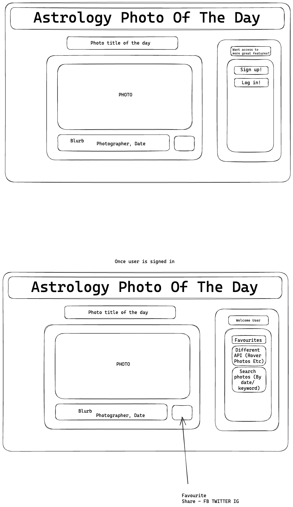

# Astrology_App
My Astrology App, Cool things to come

### About 

- Astrology photo of the day.
- Users, once signed in, can favourite photos, share and choose between a date range
- Users can add their own photos unique to their ID, this data is saved within the astrology_app database.
- Ability to like and comment on photo (maybe)

### Planning & Problem Solving

- Built my SQL table prior to thinking fully through the required columns for integrating an ability for users to add photos unqiue to them, thought I would be able to user inbuilt ID but this wasnt the case.

### Cool tech

- I like the date range picker, the ability to search through the history of astrological photos is wicked!
- Potentially a ISS (International Space Station) tracker, which would track the ISS in live time (every 5 seconds)

### to fix

### Lessons learnt

- 6Ps (Prior Planning Prevents P### Poor Performance) Limited the scope of my application during the planning stage which in turn made it more complicated for me towards the end, implementing for more advanced features. 

### Future features

